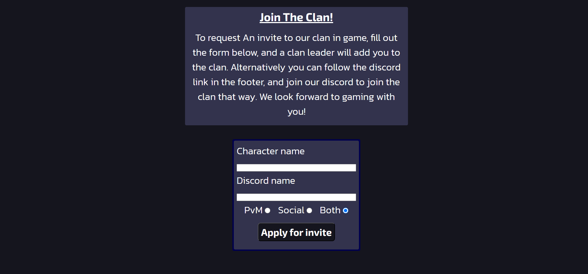

# Aether Clan Osrs

Aether Clan osrs is a website that is aimed at people who play the online MMORPG 'OldSchool Runecape', that are looking to join a 'clan'. Clans are a social aspect to the online experience of this game and tbe site advertises 'Aether clan' in order to be found by this audience. It shall advertise what the clan has to offer to the user. The site will do this mainly through displaying upcoming/past in-game events in the 'events' page. The site will also provide links to the clans social media pages if they would like more information, and also a link to the clans disboard page, so that the user can join the clan if they would like to. The user will also be provided with a signup page so that they can sign up to the clan, without leaving the site.

## Table of Contents
- [Aether Clan Osrs](#aether-clan-osrs)
  - [Table of Contents](#table-of-contents)
  - [UX](#ux)
    - [Project Goals](#project-goals)
    - [User Stories](#user-stories)
  - [Features](#features)
    - [Header](#header)
    - [Footer](#footer)
    - [Home Page](#home-page)
    - [Events Page](#events-page)
    - [Join Us page](#join-us-page)
  - [Testing](#testing)
    - [Home Page](#home-page-1)
    - [Events Page](#events-page-1)
    - [Signup Page](#signup-page)
  - [Bugs](#bugs)
  - [Validator Testing](#validator-testing)
    - [HTML](#html)
    - [CSS](#css)
    - [Accessibilty](#accessibilty)
  - [Deployment](#deployment)
  - [Credits](#credits)
    - [Content](#content)
    - [Media](#media)

## UX

### Project Goals

- The site will have a dark colour scheme, this is to fit the clans 'Space' theme in the Clan discord server.
  
- It will inform the user of clan events and morals, with an aim to help the user decide if the clan is suitable for them.
  
- Provide the user with multiple ways to join the clan, depending on what sort of content they want to take part in.
  
### User Stories

- As a user i want to be able to navigate the site smoothly.
  
- As a user i want the flow of the page to encourage me to scroll further.
  
- As a user i want to be shown key information about the clan and images to give context.
  
- As a user i want to be able to make a decision on whether i like what the clan has to offer.
  
- As a user i want to be presented with an easy way to join the clan.

## Features 

### Header

- The Header Will feature a logo that will be the name of the Clan "AETHER"

- This feature will will be fully responsive and incude home link in the logo, Home page, Events page and a Signup page.

- The nav section will allow the user to navigate to any page on the site, no matter what page your currently on.
  

### Footer

- The footer will include Social media sites relevant to Aether clan. The link will open in a new tab to make navigating back to the site easier for the user.

- The footer is valuable to the user as it provides ways to gain more information about the clan, also providing a way to join the clans social servers.

### Home Page

- The home page will include a hero image of space. This fits out 'aether'  theme and its purpose  is to attract the attention to the reader and encourage to look further.

- The section below will be an introduction paragraph to the clan, acompanied by an image of a clan activity. the purpose of this section is to provide a small amount of information about the clan, and guide the reader to find out more on the events page.

- The main aim of this page is to attract the reader to find out more about what the Clan can offer, but also make a deicision if the clan isnt right for them, with the small amount of information provided. This is to avoid wasting a readers time who is looking for a different type of clan.

### Events Page

- This page will provide more information about Clan events.

- the page will have images of clan events and text to describe them.

- It will also have the same colour scheme as the home page

- The Final paragraph of the page will direct the reader to the 'Join us' page, so they can join the clan if they wish. This paragraph will also feature a hyperlink to the 'Join us'.
  

  
### Join Us page

- This page will follow the same colour scheme as the home and events page.

- The page will feature a form to collect relevent data from the reader.
  
- The form will collect the reader In Game Name (IGN), Discord Name, and information and why the reader is joining.
  

## Testing

- I checked that the site is responsive and looks good at standard screen sizes using devtools device toolbar.

- I have confirmed that all the text is easy to read and understand.
  
- I have confirmed that all page links and social media links work as intended.

- I have checked that the form works correctly.
  
### Home Page

### Events Page

### Signup Page

## Bugs

- When trying to style the homepage image, i was struggling to get the image to do what i wanted it to do.
- After some trial and error, i placed the 'DIV' that my image was a background image of, into another DIV, then applied the CSS to the parent DIV and this fixed my issues.
  
- When first testing the signup form, the form dump showed an 'on' value for my radio buttons.
- i fixed this by adding the missing 'required checked' to all my radio buttons
  
- After attempting to set up VS Code, due to probles with codeanywhere. i managed to make my repo start failing to update my deployed page.
- This was due to some files that i accidently created inside my project when attempting to make a clone with VS Code.
- Deleting the files fixed the problem.

## Validator Testing

### HTML

- When i first ran my HTML through through the WEC validator, it returned a few minor errors.
- The errors were a few trailing slashes in my code, and the other being a missing header on my home page.
- I fixed these issues by removing the trailing slashes and adding a hidden header to my home page.
  
### CSS

- No errors were found when passing throught the official (jigsaw) validator.

### Accessibilty

- I used Devtools 'lighthouse' to confirm that my website had suitable accessibility.

## Deployment

I deployed my site using 'GitHub Pages'. the following steps are how i did it

- enter the github repository and click on the settings tab.
- in the source section, select the dropdown menu, then select the master branch.
- Once the master branch is selected, github provided a link to the completed website.

a live link can be found here - [Aether Clan OSRS](https://eddiecodehub.github.io/Aether-Site/)

## Credits

### Content

- I used code from the CI [Love running](https://eddiecodehub.github.io/LoveRunningWalkthrough/index.html) Project to help create my Header and Footer

### Media

- The Hero image on the homepage was taken from [Pexels](https://www.pexels.com/)
