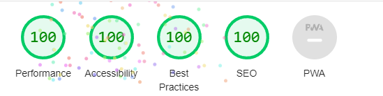

# Aether Clan Osrs

Aether Clan osrs is a website that is aimed at people who play the online MMORPG 'OldSchool Runecape', that are looking to join a 'clan'. Clans are a social aspect to the online experience of this game and the site advertises 'Aether clan' in order to be found by this audience. It shall advertise what the clan has to offer to the user. The site will do this mainly through displaying upcoming/past in-game events in the 'events' page. The site will also provide links to the clans social media pages if they would like more information, and also a link to the clans disboard page, so that the user can join the clan if they would like to. The user will also be provided with a signup page so that they can sign up to the clan, without leaving the site.

## Table of Contents
- [Aether Clan Osrs](#aether-clan-osrs)
  - [Table of Contents](#table-of-contents)
  - [UX](#ux)
    - [Project Goals](#project-goals)
    - [User Stories](#user-stories)
    - [Colour Scheme](#colour-scheme)
    - [Typography](#typography)
  - [Features](#features)
    - [Header](#header)
    - [Footer](#footer)
    - [Home Page](#home-page)
    - [Events Page](#events-page)
    - [Join Us page](#join-us-page)
  - [Testing](#testing)
    - [Header](#header-1)
    - [Footer](#footer-1)
    - [Home Page (lighthouse)](#home-page-lighthouse)
    - [Events Page (lighthouse)](#events-page-lighthouse)
    - [Signup Page (lighthouse)](#signup-page-lighthouse)
  - [Bugs](#bugs)
  - [Validator Testing](#validator-testing)
    - [HTML](#html)
    - [CSS](#css)
    - [Accessibilty](#accessibilty)
  - [Deployment](#deployment)
  - [Credits](#credits)
    - [Content](#content)
    - [Media](#media)

## UX

### Project Goals

- The site will have a dark colour scheme, this is to fit the clans 'Space' theme in the Clan discord server.
  
- It will inform the user of clan events and morals, with an aim to help the user decide if the clan is suitable for them.
  
- Provide the user with multiple ways to join the clan, depending on what sort of content they want to take part in.
  
### User Stories

- As a user i want to be able to navigate the site smoothly.
  
- As a user i want the flow of the page to encourage me to scroll further.
  
- As a user i want to be shown key information about the clan and images to give context.
  
- As a user i want to be able to make a decision on whether i like what the clan has to offer.
  
- As a user i want to be presented with an easy way to join the clan.
  
- As a user i would like any links to other sites to open in a seperate tab, this would make it easier for me to navigate back to the site.
  
### Colour Scheme

- #15151e - I chose this dark grey colour as my background. this allows lighter colours to stand out in front of it and starts off my 'Space' theme. Also fitting in with clan colours
  
- #00004d - I have chosen this Dark blue colour for my header and footer as it is the main colour of the clan. It also contrasts very well with my background

- #33334d - I have chosen this light grey colour for the background to my text sections. This colour fits with the clans scheme and also stands out from the background. it is also not too light so it allows white text to be very clear
  
- #ffffff -I have chosen this colour for my font as it contrasts best with the backgrounds of my page

### Typography

- I chose the Fonts 'Exo 2' and 'Kanit' for my primary fonts, with a back-up font of Sans-Seriff for browsers that don't support these fonts.
- I chose 'Exo 2' and 'Kanit' as i felt they fitted the theme going across our social media's, also they compliment each other well.
- I chose 'Exo 2' for my headers as it was the best font to match the clan logo.
- I chose 'Kanit' for my main text font as i felt it looked good and fitted my theme. It also complimented my header font.

## Features

### Header

- The Header Will feature a logo that will be the name of the Clan "AETHER"

- This feature will will be fully responsive and include home link in the logo, Home page, Events page and a Signup page.

- The nav section will allow the user to navigate to any page on the site, no matter what page your currently on.
  

### Footer

- The footer will include Social media sites relevant to Aether clan. The link will open in a new tab to make navigating back to the site easier for the user.

- The footer is valuable to the user as it provides ways to gain more information about the clan, also providing a way to join the clans social servers.

### Home Page

- The home page will include a hero image of space. This fits our 'Aether'  theme and its purpose  is to attract the attention of the reader and encourage to look further.

- The section below will be an introduction paragraph to the clan, acompanied by an image of a clan activity. the purpose of this section is to provide a small amount of information about the clan, and guide the reader to find out more on the events page.

- The main aim of this page is to attract the reader to find out more about what the Clan can offer, but also make a decision if the clan isn't right for them, with the small amount of information provided. This is to avoid wasting a readers time who is looking for a different type of clan.

### Events Page

- This page will provide more information about Clan events.

- the page will have images of clan events and text to describe them.

- It will also have the same colour scheme as the home page.

- The Final paragraph of the page will direct the reader to the 'Join us' page, so they can join the clan if they wish. This paragraph will also feature a hyperlink to the 'Join us'.
  

  
### Join Us page

- This page will follow the same colour scheme as the home and events page.

- The page will feature a form to collect relevent data from the reader.
  
- The form will collect the readers 'In Game Name' (IGN), Discord name, and information on why the reader is joining.
  

## Testing

### Header

- I have tested that all nav elements in the header works correctly.
- I have tested that the header is resposive when changing screens.
- I Have tested that my logo works as a home link button.
- I have checked that the header sticks to the top of the viewport.
  
### Footer

- I have checked that all my footer links open in a seperate tab.
- I Have chacked that the footer stays at the bottom of the page.
- I have checked that the logos are big enough to decipher on bigger screen sizes.

### Home Page (lighthouse)

### Events Page (lighthouse)

### Signup Page (lighthouse)

## Bugs

- When trying to style the homepage image, i was struggling to get the image to do what i wanted it to do.
- After some trial and error, i placed the 'DIV' that my image was a background image of, into another DIV, then applied the CSS to the parent DIV and this fixed my issues.
  
- When first testing the signup form, the form dump showed an 'on' value for my radio buttons.
- i fixed this by adding the missing 'required checked' to all my radio buttons
  
- After attempting to set up VS Code, due to probles with codeanywhere. i managed to make my repo start failing to update my deployed page.
- This was due to some files that i accidently created inside my project when attempting to make a clone with VS Code.
- Deleting the files fixed the problem.

## Validator Testing

### HTML

- When i first ran my HTML through through the WEC validator, it returned a few minor errors.
- The errors were a few trailing slashes in my code, and the other being a missing header on my home page.
- I fixed these issues by removing the trailing slashes and adding a hidden header to my home page.
  
### CSS

- No errors were found when passing throught the official (jigsaw) validator.

### Accessibilty

- I used Devtools 'lighthouse' to confirm that my website had suitable accessibility.

## Deployment

I deployed my site using 'GitHub Pages'. the following steps are how i did it

- enter the github repository and click on the settings tab.
- in the source section, select the dropdown menu, then select the master branch.
- Once the master branch is selected, github provided a link to the completed website.

A live link can be found here - [Aether Clan OSRS](https://eddiecodehub.github.io/Aether-Site/)

## Credits

### Content

- I used code from the CI [Love running](https://eddiecodehub.github.io/LoveRunningWalkthrough/index.html) Project to help create my Header and Footer

### Media

- The Hero image on the homepage was taken from [Pexels](https://www.pexels.com/)
